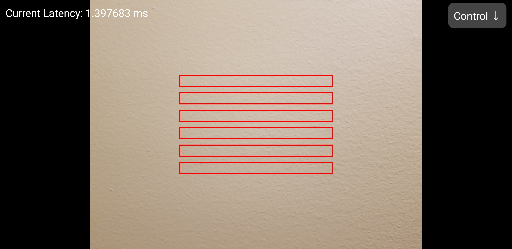

## Brokenithm-Hands-Android

A fork of [Brokenithm-Android](https://github.com/tindy2013/Brokenithm-Android) that replaces the touch-based air sensor input with camera-based hand detection.

Slider input has been removed. This app is intended to be used alongside [Brokenithm-Slide-Android](https://github.com/SinaKh0/Brokenithm-Slide-Android) handling slider input, with two instances of the [modified server](https://github.com/SinaKh0/Brokenithm-Android-Server) using the `-s` (slider only) and `-a` (air only) flags to split input across two devices.

Supports UDP and TCP connection to host. TCP recommended for lower latency.

<p align="center">
  
</p>

## Settings

**Presence Detection** - **when enabled**, the app calibrates a brightness baseline per zone on startup and detects hands by comparing against it. Supports stationary hands. **When disabled**, switches to motion detection mode which only triggers when something is moving in a zone.

**Recalibrate** - only visible in presence detection mode. Tap this with your hands completely out of view, wait a moment, then the baseline resets on the next camera frame. Recalibrate if the zones are triggering incorrectly due to lighting changes.

**X Position / Y Position** - moves the center of the sensor zone cluster horizontally and vertically within the camera frame (0-100).

**Sensor Width** - controls how wide the detection zones are (0-100).

**Sensor Spacing** - controls the gap between the 6 sensor zones (0-20).

**Camera Air Sensitivity** - controls how sensitive the zones are to brightness changes. Lower values trigger more easily, higher values require a more significant change (0.01 - 1.0). Recommended: 0.08

**Auto Screen Dim** - when enabled, the screen turns black after 30 seconds of inactivity to save battery and protect OLED displays. The camera and air detection continue running in the background. Tap the screen to wake it back up.

## Presence Detection vs Motion Detection

**Enable Presence Detection** if you play by holding your hand still in the sensor region. The app detects your hand as long as it remains in a zone without needing to move. Recalibration is needed in this mode.

**Disable Presence Detection (use Motion Detection)** if you play by waving or moving your hand through the sensor region. This mode only triggers when movement is detected. Recalibration is not needed in this mode and can result in a smoother experience.

## Dual Device Setup

To use both apps together, run two server instances on Windows:
```bash
brokenithm.exe -T -s -p 52468  # slider instance
brokenithm.exe -T -a -p 52469  # air instance
```

Connect this app to port 52469 and Brokenithm-Slide-Android on the other android device to port 52468.

## Low Latency Setup (USB)

For the lowest latency, connect your devices via USB and use ADB reverse port forwarding instead of WiFi. With both devices plugged in run:
```bash
adb devices  # to get serial of both devices
adb -s <slider_device_serial> reverse tcp:52468 tcp:52468
adb -s <hands_device_serial> reverse tcp:52469 tcp:52469
```

Then in each app use `127.0.0.1:PORT` as the server address and enable TCP mode.